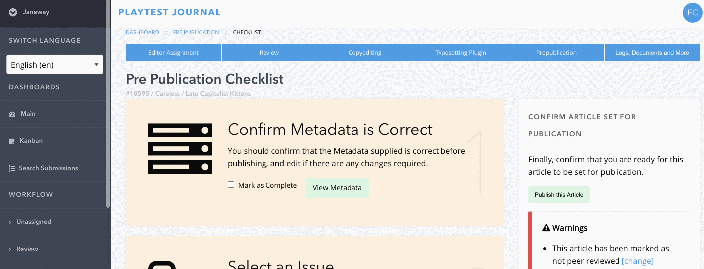
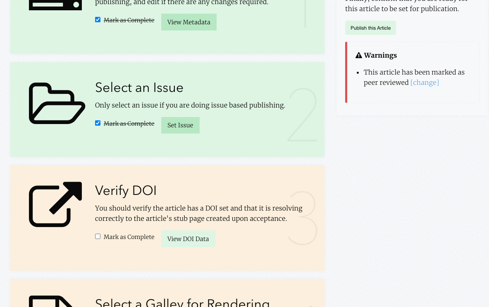
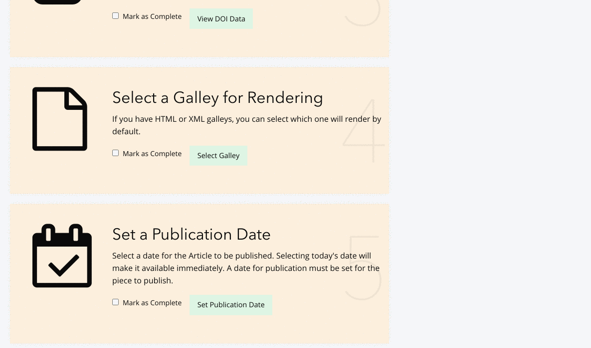

Pre Publication
===============

The Pre Publication stage of the workflow takes you through the last
checks before publication, going through each of these final elements
step by step. There are some key things to look out for in Pre
Publication, outlined in bold below.

1. View Metadata
----------------

View Metadata, the first step in Pre Publication, is where editors can
make final checks and alterations to author abstracts, titles, licences,
article citation and names/contact details. It is important to ensure
that the abstract and title in the metadata exactly match the abstract
and title of the PDF file (often, authors change their abstract during
revision and copyediting, so the original abstract needs updating before
publication). **The metadata abstract is displayed when you preview the
XML file** (if you are using XML files) **in the Typesetting Plugin or
Production stage.**

If you copy and paste an abstract into the metadata, ensure you paste
this in without formatting and, if necessary, use an HTML cleaning tool
so that the abstract text matches the formatting of the rest of the XML
text. **Use the preview XML file function in the Typesetting Plugin to
check abstracts have updated correctly.**

It is very important, for Open Access compliance purposes, that the
licence selected in the metadata matches any licensing information given
in the footer of the PDF file.

::: {.warning}
::: {.title}
Warning
:::

\*\* If an author requests a non-standard licence, this should be
flagged in advance to the typesetters.\*\*
:::

Once you have thoroughly checked the metadata, check the 'Mark as
Complete' box to move onto the next step.

2. Set Issue
------------

Set Issue, the second step in Pre Publication, is where you can assign
the article's issue(s), if this has not been done already. Click 'Add to
Issue' to add to an existing issue (you can select more than one issue
if needed, for example, if the article is part of a special issue as
well as a journal volume) or 'Create an issue' at the bottom of the pop
up window if the article belongs to a new issue. Then click the X at the
top of the pop up box to close.

Check the 'Mark as Complete' box to move onto the next step.

3. Verify DOIs
--------------

Articles usually have a DOI (Digital Object Identifier) automatically
assigned and 'minted' (created) for them by the system. The DOI serves
both as a unique identifier and a permalink. The 'Verify DOI' step lets
you check if the DOI is working successfully as a permalink.

If the DOI only has two 'hops', or two steps (shown as bullet points),
this means that no further changes are needed and you are ready to
proceed.

If the DOI has more than two hops, or you see something else, you need
to look more closely at the DOI\'s details. Select 'Edit' in the top
right hand corner of the pop up window and check the 'Status' column for
an indication of what to do next. See
`Interpreting Registration Status<interpreting-registration-status>`{.interpreted-text
role="ref"} for more help.

Check the 'Mark as Complete' box to move onto the next step.

4. Select a Galley for Rendering
--------------------------------

Select either an XML or HTML file (for OLH journals there will only be
an XML or PDF file: always select the XML file for rendering). **Check
to make sure no additional files other than publishable galleys are
visible here.** If they are, they will also be published alongside the
publishable galleys. If any other files appear here return to
Typesetting Plugin or Production to delete any other files that have
accidentally been added as galleys before proceeding.

::: {.warning}
::: {.title}
Warning
:::

**If you have not done so already, double check (in the Typesetting
Plugin or Production stage) that any typesetting queries at the very end
of the PDF have been addressed and removed.**
:::

Check the 'Mark as Complete' box to move onto the next step.

5. Set a Publication Date
-------------------------

Select a date and time for publication. Selecting today\'s date will
make it available immediately. A date for publication must be set for
the piece to publish.

Check the 'Mark as Complete' box to move onto the next step.

6. Select Article Image
-----------------------

Upload an image (JPG, PNG or GIF formats are accepted -- **NOT PDFs**)
in the pop up window. Rectangular or landscape images work best, as this
image will usually sit at the top of an article.

::: {.tip}
::: {.title}
Tip
:::

You can source many free-to-use images from Unsplash.com. Aim to choose
eye-catching images that are relevant to the article. If you are
sourcing images from elsewhere, be aware of any copyright restrictions
and only use images that you are permitted to reproduce.
:::

Once you have completed the steps in Pre Publication and have set a date
and time for an article to be published, go into 'Edit Article Images'
to select a thumbnail image (which can be the same image used for the
article banner).

::: {.tip}
::: {.title}
Tip
:::

**As thumbnail images display at the same width to height ratio as they
are uploaded, you may want to use an image editor to crop your chosen
thumbnail image into a square shape, with the same height and width, for
consistency.**
:::

Check the 'Mark as Complete' box to move onto the next step.

7. Notify the Author of Publication
-----------------------------------

The pop up window generates an email template which enables you to
notify the author, section editors and copyeditors that the article has
been or will shortly be published. You may amend and send the template
email to notify the author accordingly. The dates/times that you see
here correspond either to the timezone set in your user profile, or the
default timezone (UTC).

Check the 'Mark as Complete' box to move onto the next step.

Now click 'Publish this Article' at the top of the right hand column.
Your article has now been published, or will be ready to publish at the
time and date previously set. When the article goes live, always check
that the article is displaying correctly on the homepage, on the
Articles page and in its XML/HTML and PDF formats.

**The publishing workflow is now complete -- congratulations on your
finished article!**
