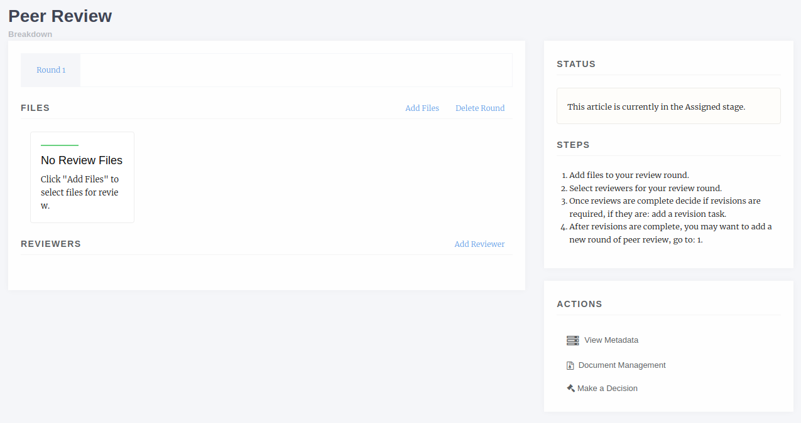
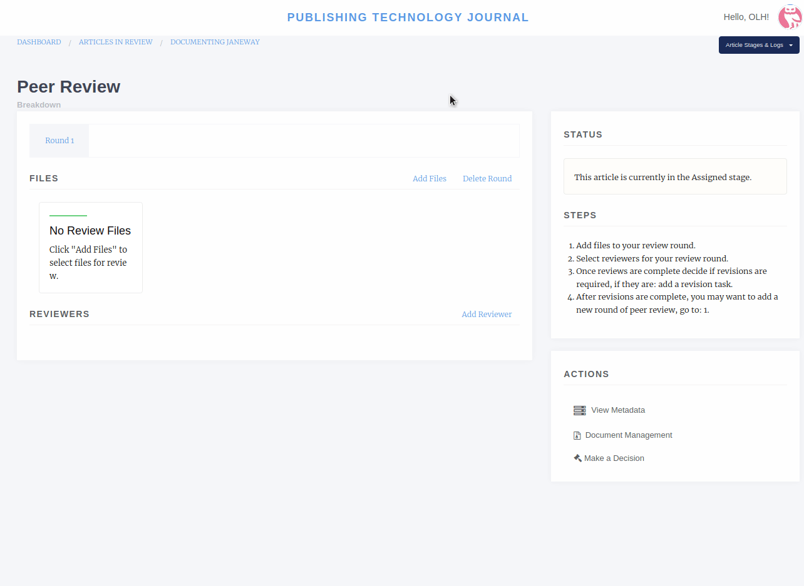
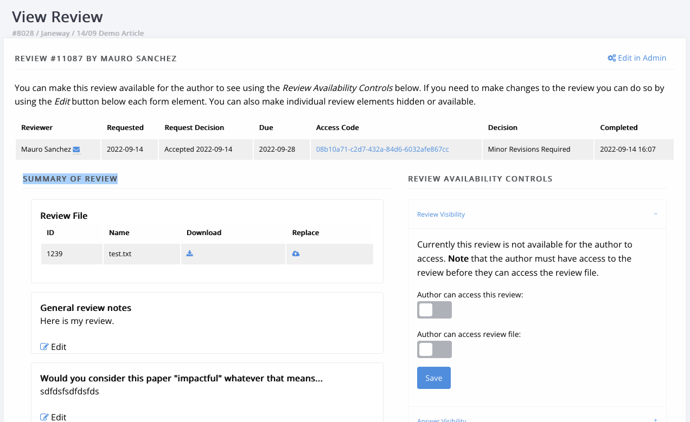
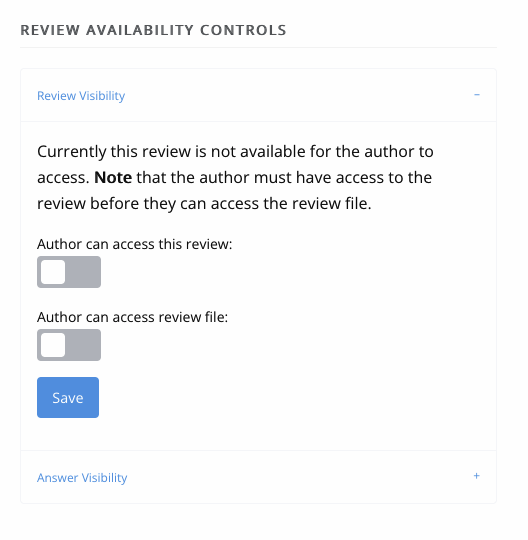
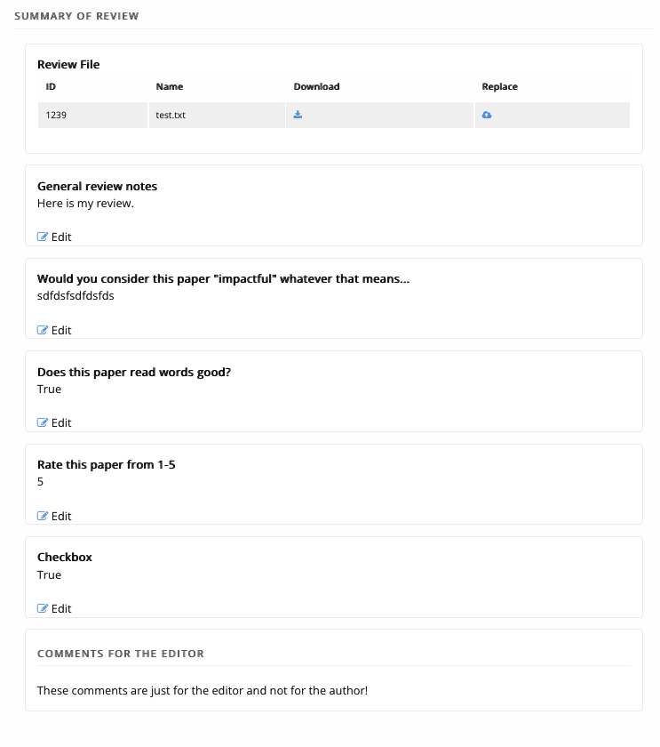
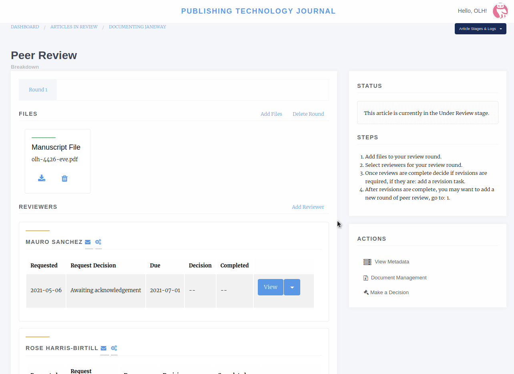
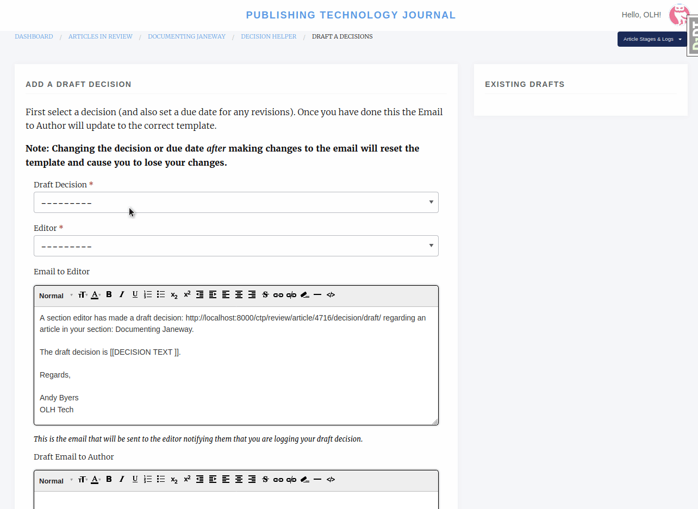

Review
======

Unassigned Article
------------------

Once an Author has submitted an article it is the Editor\'s turn to
review the unassigned article, assign an Editor and move it into the
review process. An Editor will be notified once an article is submitted,
the email will contain a link, or the Editor can access the article from
the Dashboard page.

Selecting Unassigned will provide the Editor with a list of articles
that haven\'t yet been assigned an Editor and moved into review. You can
view the data for an article by selecting \"View\". On the left hand of
the page all of the article\'s metadata will be listed, on the right,
its options and actions.

The first thing an Editor needs to do is assign an Editor or Section
Editor to the handle the article through the journal workflow. Once
assigned, the Editor can then do one of the following:

1.  Move the article to review
2.  Reject the article outright
3.  Accept the article outright

Rejecting will allow you to tell the author why, Accepting will move it
into Copyediting (if you have the default workflow) and Moving to Review
will move the article into the Review workflow.

If you move the article into review and are the author of an article you
will be blocked by a permission denied page.

If you opt to over-ride the security warning, all other Editors will be
notified of this.

{.with-border}

Review Page
-----------

The review page presets various actions:

1.  Add Files
2.  Delete Round
3.  Add Reviewer
4.  New Review Round
5.  Request Revisions

Add Files
---------

The Add Files options allows you to list which files will be listed for
the reviewers in the current review round. All reviewers for a given
round will see the same files. You will also be asked to confirm that
the files you\'ve selected have been checked to ensure there is no
identifying author information in them. If there are you can download,
edit and replace the version in the system on this screen.

Delete Round
------------

This is an end all button, it will remove the files and reviewers from
the current round. You will be given a prompt that explains what will be
deleted if you agree, **NB**. **there is no way to recover a review
assignment once it is deleted so only use this option if you really want
to remove it, better to add a new round which will close all open review
assignments.**

Add Reviewer
------------

When adding a reviewer you have two options, you can select a reviewer
and go through the process of setting up their review (anonymity, form
and due date) or, if you\'ve setup the required defaults, you can
\"Assign with Defaults\". This will use the default type, anonymity,
form and due date for your journal and send an automated email to the
reviewer (the former allows you to edit the email).

Assuming you choose to select the options yourself, when you press \"Add
Reviewer\" you will be taken to the \"Notify\" page where you can edit
the outgoing email to the user. There is an option available to skip
sending this email if you wish.

Once the reviewer is assigned they will be able to access the system and
let you know if they will complete the review and, if yes, access the
review form you specified.

Managing a Review
-----------------

Once you have added a review to your round, it will be listed on the
review page. The initial stage of any review is \"Awaiting
acknowledgement\" which means we are waiting on the reviewer accepting
or declining to undertake the review. At this stage we can:

1.  View the review, though it doesn\'t tell us much
2.  Withdraw the review
3.  Delete the review
4.  If the review is withdrawn or declined by the reviewer we can use a
    new option Reset to set it back to Awaiting Acknowledgement

Making Reviews Available to Authors
-----------------------------------

Once a peer review is complete, editors then have the option to make it
available to the the author to read. By default the review will not be
available for the author to read. When the review has a file, you will
also have the option to make the file available for the author to read.
Once you have opened a review you will see a details of the review
assignment, a summary of the review and the review availability
controls.

### Allow Author to Read Review

You can make the review form visible to the author by toggling *Author
can access this review*, and the file available by toggling *Author can
access review file*.

### Controlling Individual Answers

In addition to making the overall review available for authors to read,
you can control the individual form answers under *Answer Visibility*.
Toggling the answers on or off will determine whether the author can see
them when they look at the review.

### Editing Answers

You can edit individual answers to create an *edited version*. When
viewing the review the author will see only your edited version and not
the original version from the reviewer. You can reset the answer at any
given time. Note that Janeway will retain a copy of the original and
display it for other editors to see.

Once you have adjusted the visibility of Peer Review reports, and have
clicked through to 'Make a Decision', you will see a summary of the Peer
Reviews and what is and what is not revealed to authors before sending
your Decision.

Decision Helper
---------------

::: {.warning}
::: {.title}
Warning
:::

As of version 1.3.10 all review decisions have been moved to the
Decision Helper page.
:::

One of the options under Actions is \"Make a Decision\" this will take
you to the Decision Helper page. Once on this page you will see a
summary of reviewer recommendations, their review form answers and a
list of uncompleted reviews. The decisions available from this screen
are:

-   

    Accept Article

    :   -   Accepts the article, allows you to email the author and
            moves the article into the next stage.

-   

    New Review Round

    :   -   This option adds a new review round, a clean slate of
            review! Any open review assignments on the current round are
            withdrawn and a new round is set up. This process is often
            done after round 1 is complete and the author has also
            completed some form of revisions. You will still be able to
            see Round 1 via a tab at the top of the page.

-   

    Reject Article

    :   -   Rejects the article, removes it from the workflow and allows
            you to email the author.

-   

    Request Revisions

    :   -   Allows you to request the author revise their paper.

-   

    If enabled, Draft a Decision

    :   -   Allows Section Editors to draft one of the above decisions
            for approval by an Editor.

-   

    Share Peer Reviews

    :   -   Allows an editor to email all of the reviewers who
            participated in the review of an article and share a link
            allowing them to read all of the review reports. Note: This
            must first be enabled before the option will be displayed.
            See the
            `Sharing Peer Reviews<sharingpeerreviewsanchor>`{.interpreted-text
            role="ref"} section.

Request Revisions
-----------------

::: {.tip}
::: {.title}
Tip
:::

Before requesting revisions make sure you have marked reviews as
available to the author. The Request Revisions page will warn you if you
have not done this for a given review.
:::

Requesting revisions will allow you to ask the Author to make changes to
the manuscript, this may be for editorial reasons or as the result of a
round of peer review. Usually the process would be:

1.  

    Review Round 1

    :   1.  Reviewer 1
        2.  Reviewer 2

2.  Accept/Decline/Revisions based on reviewer feedback

3.  Request Revisions

4.  

    Review Round 2

    :   1.  Reviewer 3
        2.  Reviewer 4

5.  Action based on reviewer feedback

Draft a Decision
----------------

Draft Decisions (DD) is an optional workflow that requests that Section
Editors submit a draft of their editorial decision for approval by an
Editor before it is sent to the author via the system. When enabled, a
Section Editor will only see the Draft Decision feature on the Decision
Helper page.

Section Editors:

1.  Go to the Decision Helper page.
2.  Select Draft Decision.
3.  Complete the form, following the onscreen instructions.

Editors:

1.  Will be notified when a Draft Decision is made.
2.  Open the link in email.
3.  Review the draft.
4.  Edit, Accept or Decline the Draft.
5.  If accepted the decision event will fire.

Examples of Draft Decisions are: Accept, Minor Revisions, Major
Revisions or Decline. Editors are required to approve these Draft
Decisions (DD) before they are sent to Authors.

If the DD is Accept, an article is moved into Copyediting.

If the DD is Minor Revisions, the Section Editor should provide the
Author with guidance on how to implement the feedback from the Peer
Reviewers.

If the DD is Major Revisions, the Section Editor should provide the
Author with guidance on how to implement the feedback from the Peer
Reviewers. If an article requires Major Revisions, then another round of
Peer Review must be undertaken once the Major Revisions are complete.

If the DD is Decline, the article will be archived and the author
notified.

To approve a DD:

1.  Click on the link in the email notifying you of the DD
2.  Click 'Edit' in the 'Existing Draft Decisions' box on the upper
    right hand side of the screen (NB do not start filling in the 'Draft
    Decision' form -- your Section Editor will already have drafted an
    email to the author in 'Existing Draft Decisions)
3.  Review the email to the Author and the Peer Review reports. Helpful
    Tip: You can open the 'Reviews' tab for the article in a separate
    window to compare the Peer Review Reports with the DD
4.  Click 'Approve' to action the DD

Sharing Peer Reviews
--------------------

::: {.note}
::: {.title}
Note
:::

This is a new feature added in v1.5.1.
:::

In Janeway, editors have the ability to share completed peer reviews
among the reviewers who took part in an article review process. There
are two ways to accomplish this, and both can be managed through the
Review Settings interface.

1.  The first method involves a new decision available on the decision
    helper screen. With this option, editors can mark the reviews of an
    article as shareable. Additionally, an email will be sent to all the
    reviewers who participated in the peer review, providing them with a
    link to access and view the review content.
2.  The second option simplifies the process by automatically sharing
    completed reviews from previous rounds with reviewers in rounds 2
    and beyond. When reviewers access the review interface, they will be
    given the choice to view anonymous reviews completed by their peers.

Please refer to the documentation on
`Sharing Peer Reviews<sharingpeerreviewsanchor>`{.interpreted-text
role="ref"} for detailed information on how to activate these
functionalities.

### Share Reviews Decision

Once the setting is enabled a new decision option will show on the
decision helper page.

Editors then can send an email to each of the reviewers providing them
with a link to access and view the review content.

Reviewers can use the link in the email to access the shared reviews
interface.

### Display Completed Reviews in Review Interface

Once this setting is activated, editors don\'t need to take any
additional action. Reviewers in round 2 and all subsequent rounds will
automatically have access to view the reviews completed in previous
rounds. For instance, in round 3, reviewers will be able to see the
completed reviews from rounds 1 and 2, but not the reviews completed
specifically for round 3.

Editors have the ability to modify the message that clarifies the reason
why reviewers can see the reviews in the manager interface.

### Sharing Author Response Letters

In the revision process, authors are encouraged to provide a written
response to review comments. If editors want to share the authors\'
response letters along with peer reviews, they can enable the
\"Automatically Share Author Response Letters\" option in the review
settings section.

An Example Review Round
-----------------------

Here is an example of a review round.

1.  Add Files for Round 1.

2.  Add Reviewer A to Round 1.

3.  Add Reviewer B to Round 1.

4.  Add Reviewer N to Round 1.

5.  Wait for responses from Reviewers (Editor will be notified by email
    when Reviewer makes an action).

6.  

    When responses are back: Make a Decision (Accept, Decline or Request Revisions).

    :   1.  If Draft Decision is enabled and you are a Section Editor
            you will be asked to Draft a Decision for a Senior Editor to
            approve.
        2.  Accept will move the article to the next stage.
        3.  Reject will remove the article from the workflow.
        4.  Request Revisions will allow the author to see any reviews
            that have been marked for their consumption and revise their
            manuscript.

7.  

    If Revisions were requested and another round of review is required:

    :   1.  Start a new Review Round.
        2.  Go to the start.

Finishing Up
------------

When in the standard workflow, after Review comes Copyediting.

To complete the Review stage you can select one of either:

1.  Accept Article, moves the article into the next stage.
2.  Decline Article, removes the paper from the workflow.
