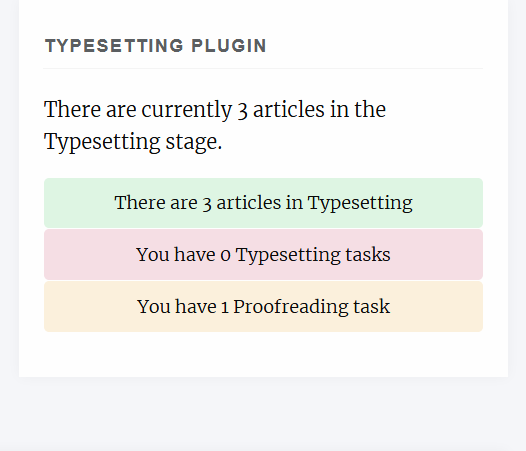
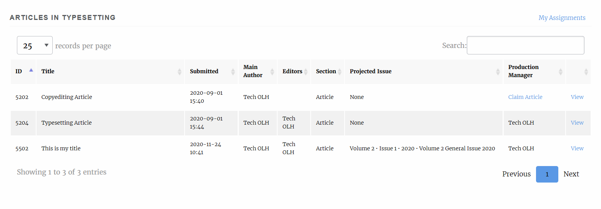
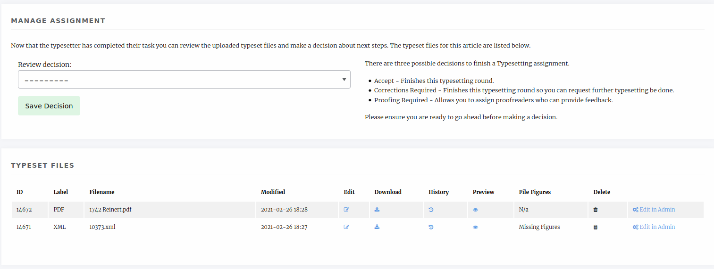
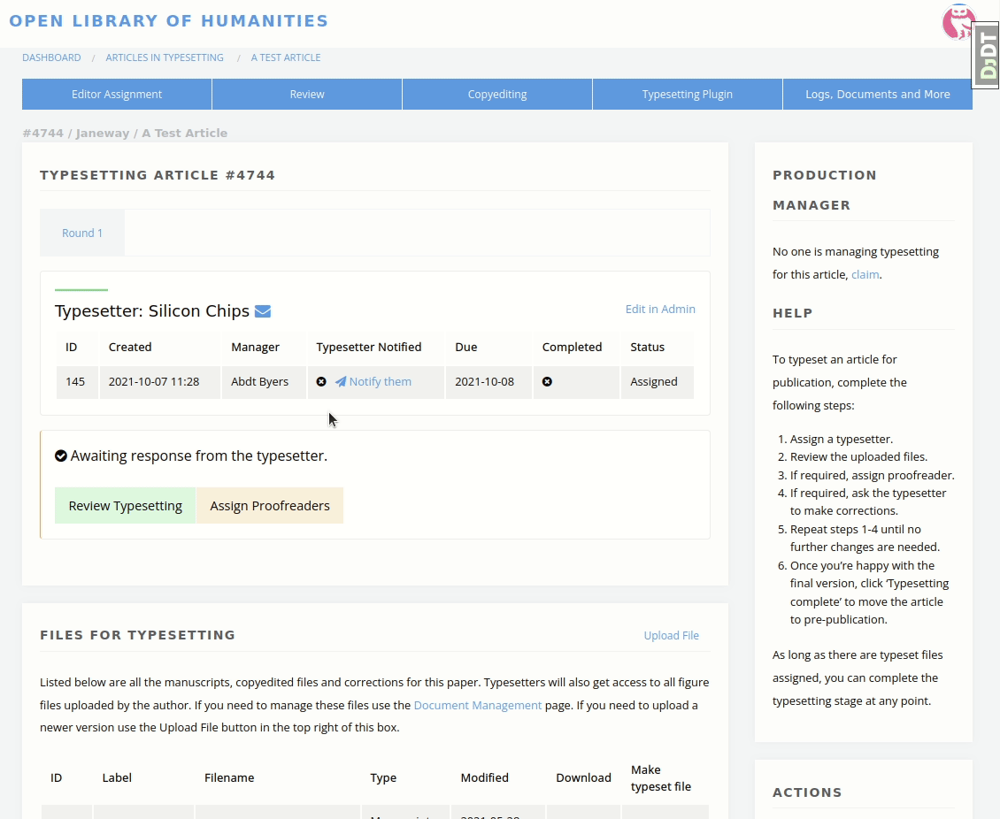
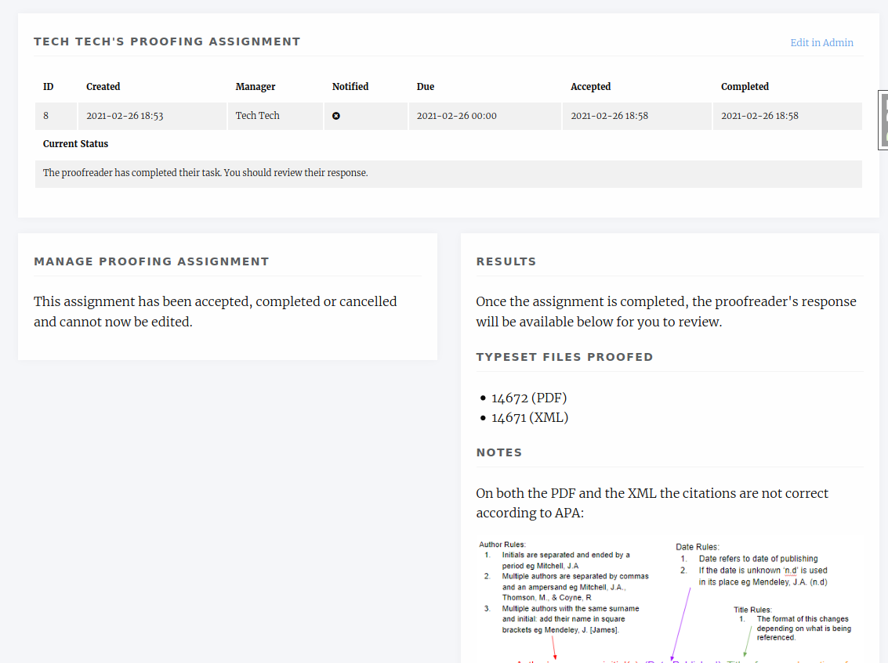
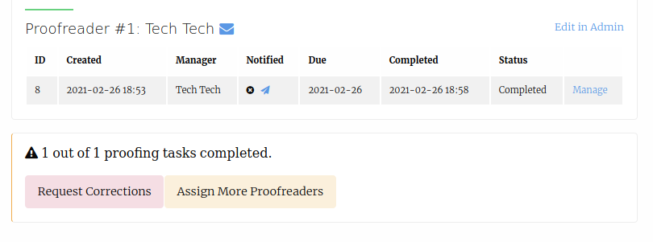
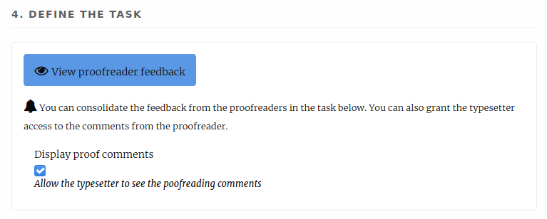
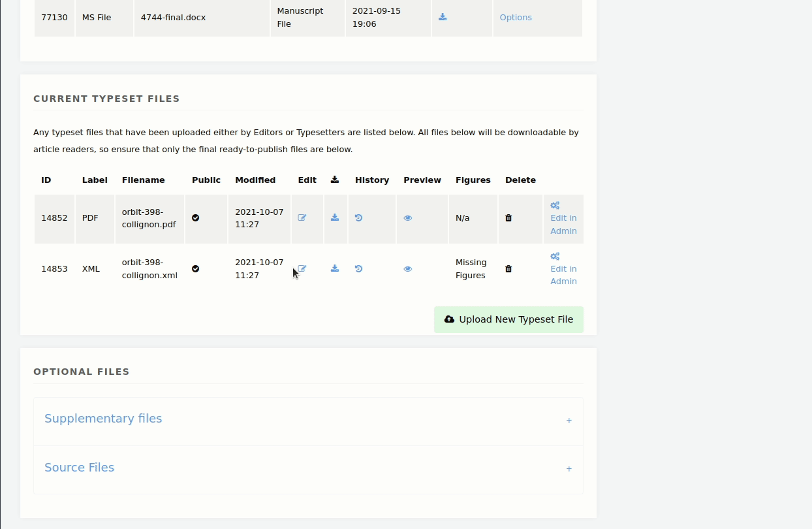
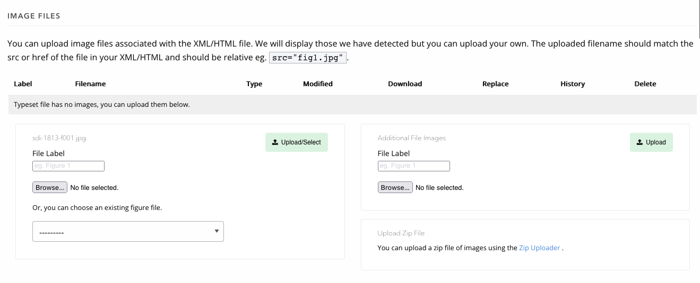

Typesetting (Plugin)
====================

The typesetting plugin is a new workflow element introduced with the
release of Janeway v1.3.8 This new element aims to simplify the
production process by combining the generation of the final article
files (Refered to as \'typeset files\') with the process of proofing
such files.

Usually typeset files include but are not limited to:

> -   A PDF file
> -   An HTML file
> -   An XML file such as JATS-XML (Janeway can render JATS-XML files on
>     the website as HTML with the use of XSLT)

{.with-border}

All the typeset files will be available to be rendered or downloaded
from the article page once your article is published.

To get started with the typesetting plugin, contact your site
administrator. You can find more details [on
GitHub](https://github.com/BirkbeckCTP/typesetting).

In a future release of Janeway, Typesetting will replace the Production
and Proofing workflow elements.

The Typeseting plugin dashboard
-------------------------------

When the typesetting plugin is installed and enabled as part of the
workflow of a journal, every user will get a typesetting card on their
dashboard. These card, will show different buttons depending on the
roles available to the user logged in.

-   Articles in typesetting (Shown to Editors and Production managers)
-   Typesetting tasks (Shown to Typesetters)
-   Proofing tasks (Shown to all Authors, Editors, and Proofreaders)

Articles in Typesetting
-----------------------

From this view, editors and production managers can see all the articles
currently on the typesetting stage as well as an overview of their
status. There is an option to \"Claim\" an article. It does not have any
practical effects, other than displaying who is managing the article to
all the members of staff. This doesn\'t not restrict access to the other
editors and production managers in the journal.

There is also a filter on the top-right-hand corner to display only
articles that have been previously claimed by you (\"My Assignments\")

Typesetting Article (Editor/Production Manager view)
----------------------------------------------------

On this page, editors and production managers can control the production
process of the article, including uploading article files, generating
typeset files, or creating assignments for Typesetters and/or
Proofreaders to upload new typeset files of proof typeset files
respectively

As shown on the image above, there is a small step-by-step guide that
assumes a user with the Typesetter role will produce the final Typeset
file. This however, is not the only workflow possible with the
Typesetting Plugin.

Generating Typeset Files
------------------------

The typesetting plugin supports 3 mechanisms for adding typeset files.

1.  Manual Upload: If you produce your typeset files by yourself (e.g.:
    Generate a PDF from MS word or a specialised tool), scroll down to
    the \'Current typeset files\' section\' where you will be able to
    upload them. When selecting your file, you can also add a custom
    label. This label will be presented to users in the article page as
    \'Download \<label\>\' (e.g \'Download PDF\'). Janeway will always
    set the label automatically for common typeset file types (PDF, XML,
    HTML\...). For unknown file types it will set it as \'OTHER\'.

::: {.tip}
::: {.title}
Tip
:::

Labels can be used to denote the language of a file to readers. For
instance labelling a pdf file as \'PDF (EN\') and another as \'PDF
(ES)\' will allow readers to download the correct PDF for their language
:::

::: {.tip}
::: {.title}
Tip
:::

If you are unsure about the label to use, leave it empty. Janeway will
try to workout the best label for your file and you can edit it later if
necessary.
:::

2.  Generate a Typeset File with Janeway Tools: Janeway provides a
    plugin system that allows developers to write integration tools for
    the typesetting process. One example is the [Pandoc
    Plugin](https://github.com/BirkbeckCTP/pandoc). which can generate
    an HTML typeset file from a MS Word document. If you are interested
    on installing this tool others of this kind, check what is available
    with your site manager.

::: {.tip}
::: {.title}
Tip
:::

The first option is always \'Convert\', which will make the current file
available as a typeset file to readers. This feature is useful when you
want to make the original manuscript file available for download to the
readers as it is (e.g.: Allow the readers to read the original
manuscript as a .docx or similar)
:::

3.  Delegate the task to a Typesetter: If your journal uses either a
    dedicated member of staff or a third party service for the
    generation of the typeset files, you can have them register on your
    site and enrol them as \'Typesetter\' \[TODO: link to roles docs\].
    Using this workflow will allow you to assign and manage typesetting
    tasks, handover the files for the authors/editors for proofing\...
    All within the system. In order to assign a typesetter we recommend
    following these steps

3.1 Verify the \'Files for Typesetting\':

:   This section will show you all the manuscript files that have been
    created during the workflow, including the original manuscript,
    files for peer-review, copyedited manuscripts etc. You will be able
    to select one of this files as the source file for your typesetter
    to produce the typeset files. You will be able to select one or more
    of these files to be used by our typesetter. If you want to upload a
    new file at this point for the typesetter to use as a base, you can
    still do so from the \'Upload File\' link on the top-right corner of
    the panel:

::: {.tip}
::: {.title}
Tip
:::

Images and other supplementary files are not shown on this panel. They
can be managed from the \'Document Management\' button, under
\'Actions\'. The Document Manager is always available throught the
workflow in case you want to check, replace or delete any files for the
article.
:::

::: {.tip}
::: {.title}
Tip
:::

The typesetter will have access to all the metadata fields for the
paper, so we recommend checking that you revise the metadata to ensure
it is production ready. You can do so from the \'Article Metadata\'
under \'Actions.\'
:::

3.2 Assign a Typesetter:

:   From this page, you can now create a task for the typesetter to get
    started with the production of the Typeset Files. At this point, you
    will have to select :

    -   A Typesetter to work on the article.
    -   One or more manuscript files the typesetter should have access
        to. (They will have access to all the image files)
    -   A Due date for the task to be completed by.
    -   A Message for your typesetter, describing any details about the
        file to produce. (They will have access to all of the article
        metadata)

3.3 Send a notification email:

:   When you complete the previous form, you will be presented with a
    screen to check the notification email. You can tweak the
    notification before it goes out to the typesetter in case you want
    to add any extra details as well as an option to attach any files to
    the email. There is no need to attach any of the article files, they
    will have access to all the files you made available for them in the
    previous step once they log into the system. There is also an option
    to skip the email notification, however we recommend you always send
    out this notification.

At this point, the task has been created and we can monitor its progress
from the \'Typesetting Article\' page.

{.with-border}

It shows details such as the current status of the task, whether or not
the typesetter has accepted/declined to do the task as well as its due
date. The \'Review Typesetting\' button will, at this point allow you to
edit any of the details of the assignment such as the files made
available, the task assignment or the due date, as well as let you
cancel the task if needed.

Reviewing the typesetting task
------------------------------

Once the typesetter has completed their task, you will receive an email
notification. The link on the email should direct you to the
\'Typesetting Article\', where you can hit the review button to check on
the files provided by the typesetter:

{.with-border}

As an editor or production manager we can now select one out 3 choices

:   -   Request Corrections: If we notice a problem with the typeset
        files straight away, we can requet corrections to the
        typesetter.
    -   Proofing required: Accepts the typeset files and records the
        decision to send the files for proofing
    -   Accept: If no further proofing is required, we can accept the
        files as they are and end the typesetting stage.

Sending a proofreading request
------------------------------

Files provided by the typesetter are usually sent to the authors, and
potentially other editors, for proofreading. Janeway allows you to
create a proofing task, where authors and/or editors can be invited to
proof the typeset files.

{.with-border}

Reviewing a proofreading request
--------------------------------

As the author/editors finish the proofing process you can review their
comments.

{.with-shadow}

Depending on the feedback coming from the proofreading, it may be
necessary to request corrections from the typesetter. In Janeway you can
request corrections from the typesetter by creating a new \'Typesetting
round\' that initiates the typesetting process for the article with the
difference that we can now include the feedback from the proofreaders on
our task

Requesting Corrections
----------------------

As soon as all proofing tasks are completed we will hit the request
corrections button, which will start a new round of typesetting.

{.with-border}

Now we can asssign a typesetter to work on the corrections (usually, the
same typesetter that produced the Typeset Files in the first place).
When creating the task, we will be presented with the option to include
the feedback from the proofreaders.

{.with-border}

Even when the comments are made available, it is still recommended that
the editor/production manager summarises the corrections requested using
the \"task\" field (especially in cases where the proofreaders might
request contradictory corrections). We can also select which files the
typesetter needs to apply the corrections to:

{.with-border}

After the task is sent out, we just have to wait for the typesetter to
complete it, at which point we can review their work and dispatch new
proofing tasks to the author if necessary, or accept their changes and
complete the process.

Supplementary Files
-------------------

Authors are able to upload supplementary files to Janeway as part of
their submission. If the intention is to host the file on Janeway
Editors can create a Supplementary File object and assign it a DOI
within Janeway. This section is located at the bottom of the Typesetting
Article page. If the file isn\'t already uploaded to Janeway you can opt
to upload a new file.

::: {.tip}
::: {.title}
Tip
:::

You should create the supplementary file object in advance of sending
the article for typesetting where possible and notify the typesetter (if
you use external typesetters). They will be able to see the file record
and the DOI that has been assigned to it.
:::

{.with-border}

Managing Typeset Files/Galleys
------------------------------

Once a typesetter or production manager has uploaded typeset files into
Janeway they become manageable within the system. To manage a typeset
file/galley press the Edit icon on the relevant table row.

{.with-border}

An XML typeset file with missing figure files.

### File Detail

{.with-border}

The file label is displayed on the main article page and is displayed in
the format \"Download Label\". If you set the label to XML it will read
\"Download XML\".

::: {.tip}
::: {.title}
Tip
:::

When uploading a PDF, XML or HTML file Janeway will set the label for
you automatically if you leave it blank.
:::

You can also mark a typeset file as not for public consumption by
unchecking the \"Public\" field in this section.

### Replacing the Typeset File

{.with-border}

If you need to upload a new version of the typeset file you can do so
from within the Edit Typeset File screen. Browse for the new file and
click Upload. The old version of the file is retained. Alternatively you
could mark this file as not public and upload a new typeset file if you
wanted to keep two separate file records.

### Image/Figure Files

HTML and XML files that are uploaded will be scanned by Janeway to
detect graphic, figure or img tags. If tags are found that have no
corresponding Image file will report on the main typesetting page as
having missing images. (see figure at the top of this section for an
example). You can load up images against a typeset file by editing it
and scrolling to the Image File section.

{.with-border}

For each missing image file Janeway will present you with a block where
you can either upload a new image file or select an existing one from
the images already linked to the article.

::: {.tip}
::: {.title}
Tip
:::

For typeset files with a large number of images you can also create a
zip archive and place an image (with a name matching those in the file)
and upload it using the Zip Uploader. Janeway will unzip the archive and
assign the images based on their name.
:::

### CSS File

If a given article requires special styling you can upload a CSS file
alongside it and Janeway will output it on the article page.

::: {.warning}
::: {.title}
Warning
:::

The CSS uploaded here should only target elements inside the \<article\>
block otherwise it could break general styling of the site.
:::

### XSL File

Janeway\'s XSL Transformation process uses a version controlled XSL
(Extensible Stylesheet Language) file. When you upload a JATS XML file
to Janeway it marks the file as using the current XSL file. This means
that as we make changes to the XSL file it will only affect future files
uploaded and not any back content.

::: {.warning}
::: {.title}
Warning
:::

Changing a XML file\'s XSL may cause it to render differently. It is
only recommended that you do this before sending it for Proofreading.
:::
