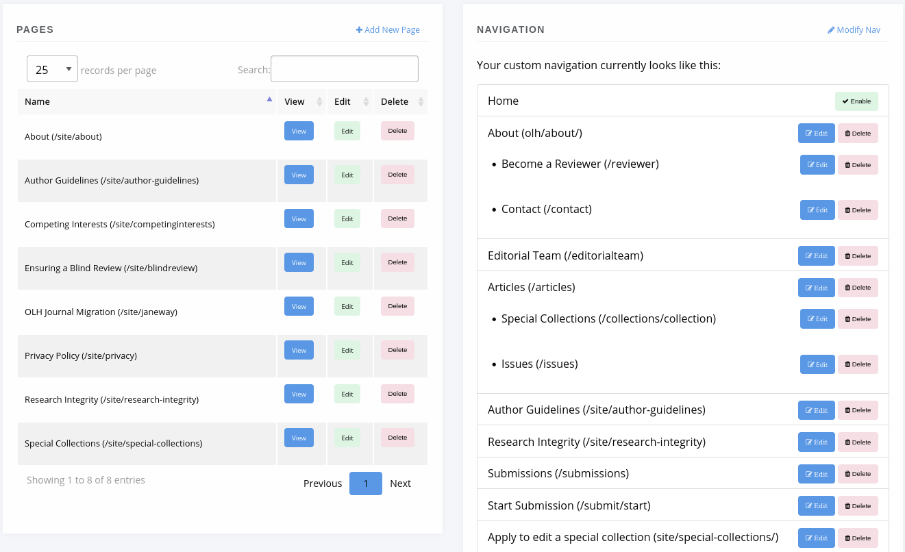
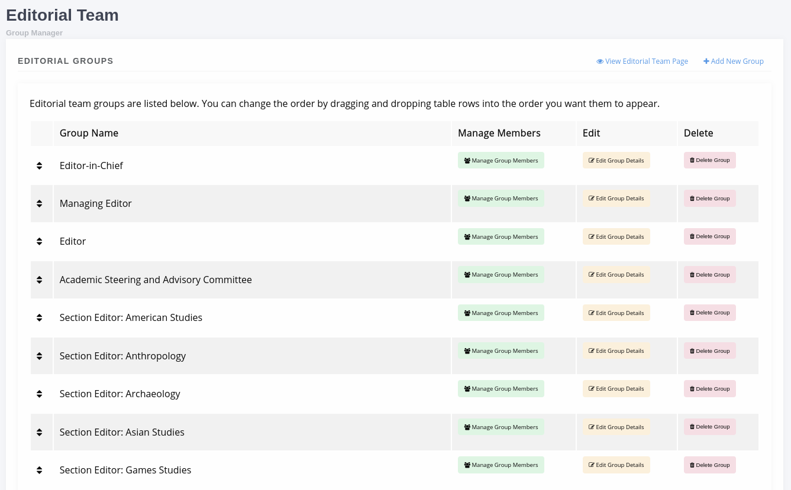
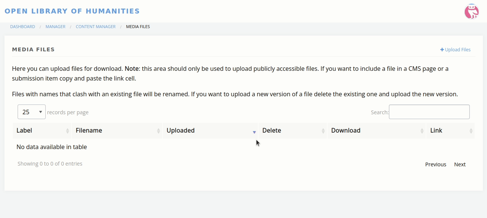

Content
=======

The content section allows us to control the navigation menu, content
pages, news and editorial team in Janeway.

Content Manager
---------------

The Content Manager is Janeway\'s CMS. Pages can be created an edited
using our rich text editor.

### Add a New Page

To add a new page to your journal select \"+ Add New Page\" and fill in
the fields as detailed in the text beneath each field.

The URL for the page will be generated with these parts:

-   Your journal\'s domain name (e.g. orbit.openlibhums.org)
-   The path element "site" (a namespace for custom pages)
-   The path you entered in the **Link** field.

An example: <https://orbit.openlibhums.org/site/privacy>

### Edit a Page

From the Content page you can see a list of the pages currently on your
journal. Select Edit to make changes.

### Delete a Page

To delete a page use the red Delete button.

::: {.warning}
::: {.title}
Warning
:::

Data cannot be recovered so ensure you really want to remove a page
before pressing the delete button.
:::

### Navigation

The nav bar is made up of two kinds of items:

-   Fixed nav elements that you can turn on or off
-   Custom nav items that you can create and modify

Fixed nav elements include:

-   Home
-   News
-   Articles
-   Issues
-   Collections
-   Editorial Team
-   Submissions
-   Contact
-   Start Submission
-   Become a Reviewer

To add a new custom nav item, from the content manager page, select
\"Edit Nav\" and fill in the fields as desired. Details of how each
field works are displayed below the field.

Footer Navigation
-----------------

With some themes, you can put a navigation link in the footer rather
than the top navigation bar.

Use **For footer** to switch the link to the footer. At the press level,
only the path theme support this feature so far.

{.screenshot}

Press managers can also create custom footer links that extend to all
journal websites, such as for publisher policies.

To do so, create a navigation item and check **Is external**, **For
footer**, and **Extend to journals**.

{.screenshot}

News Manager
------------

The news manager allows you to create news items, assign display and
take down dates and upload images to display alongside them.

News items can also displayed in the
`carousel<carouselanchor>`{.interpreted-text role="ref"}.

To add a new news item select the *News Manager*. The interface displays
exiting news items on the left and a form for adding new items on the
right.

The form fields include:

-   

    Title \*

    :   -   The title of the news item

-   

    Body \*

    :   -   The HTML body of the news item

-   

    Start display \*

    :   -   The date to start displaying this news item

-   

    End display

    :   -   The date to stop displaying this news item (can be left
            blank to display forever)

-   

    Sequence \*

    :   -   Use for sorting when news items are posted on the same day

-   

    Image file

    :   -   An image file to fit the news piece, ensure you have the
            rights to post it

-   

    Custom Byline

    :   -   Lets you overwrite the name displayed as the originator of
            the news item

-   

    Tags

    :   -   A series of tags/keywords for the piece, you can filter news
            items by tags

Journal Contacts
----------------

You can control the contacts listing for your journal by adding and
removing contacts through this interface. Only three fields are used for
this:

-   

    Name

    :   -   The contact\'s name

-   

    Email

    :   -   The email address that should be contacted

-   

    Role

    :   -   The contact\'s role e.g. Editor or Publisher

Each outgoing message is recorded in the database and can be viewed in
the admin area by staff.

Editorial Team
--------------

The Editorial Team interface is relatively complex and is made up of:

-   Editorial Groups
-   Editorial Group Members

You can create as many groups as you like and add as many members as you
like.

When you access the interface the form for making a new group is
displayed on the right of the page and the existing groups listed on the
left. For each group you can:

-   Edit the membership
-   Edit the group details
-   Delete the group
-   Drag and drop to re-order them

::: {.tip}
::: {.title}
Tip
:::

As of version 1.4 the Group description field supports HTML and presents
a rich-text editor. If you do not wish to add an account for each user
you can simply list them in the rich text box using, for example, a
bulleted list.
:::

### Adding a New Group

Creating a new group allows you to add members and display them on the
Editorial Team page. Each group is headed by the group name you supply.

-   

    Name

    :   -   The group name e.g. Editoral Team or Advisors

-   

    Description

    :   -   Displayed under the Name header on the Editorial Team page

-   

    Sequence

    :   -   The order the groups should be displayed, you can reorder
            the groups by editing their sequence or by dragging and
            dropping their record

### Adding Members to a Group

For an existing or newley created group you can use the Edit Members
button (Green with a group of outlines) to change the membership of the
group.

On the left is a list of the current members, you can:

-   Delete a member from the group
-   Reorder the members by dragging and dropping a listing

Journal users are listed on the right and you can add a user to the
group using the *Add* button. If a user account does not exist for the
user you can use the *Add New User* button to add them.

Submission Page Items
---------------------

A new addition to v1.4 the Submission Page Items system lets you totally
customise the Submission page to your liking. The existing submission
items have automatically been setup for you and can now be edited.

You can manage submission items in three ways:

-   Link to a setting
-   Custom HTML
-   Special Display

From the main screen you can add new, edit existing and delete items as
well as re-order them by dragging and dropping rows of the table.

### Link to a Setting

You can opt to link a submission item to an existing setting so it will
display the same content as that setting. This is currently used for the
majority of the automatically generated submission page items. Some
examples of this are:

-   About
-   Focus and Scope
-   Submission Checklist

You can tell when a submission item is linked to a setting under the
\'Setting or Text\' column in the main table or the \'Existing setting\'
field being completed when editing a submission item.

### Custom HTML

A submission item can also just have some custom HTML, you can fill out
the \'Text\' rich text box. When using the Text field you should not
select an Existing Setting or this will take precedence when the page is
rendered.

### Special Display

Special Display settings are used to display Licenses and Sections on
the Submission page. To add these blocks you need to set the title of
the item to either:

-   licenses

or

-   sections

You must also leave \'Text\' and \'Existing setting\' blank. This will
render a special template that displays all publicly available sections
or licenses.

#### Media Files

The Media Files manager lets editors upload and host small files.
Examples include:

-   Author Guidelines
-   Proofing Guidelines
-   Article Submission Templates

Once a file is uploaded a link is provided that you can then insert into
CMS pages or templates.

::: {.note}
::: {.title}
Note
:::

The Media Files section should not be used to upload videos unless you
have sufficient storage space/bandwidth. If you use Janeway Hosting you
should contact the support team.
:::

### Copy-Paste and Rich Text Fields

When working on webpages, news items, and other fields such as
abstracts, many people copy and paste from a word processor into
Janeway. As of version 1.5.1, Janeway handles this better than before:
When a user attempts to paste text that carries over styling from
another application, Janeway will prompt the user to ask if they want to
retain the formatting or paste as plain text.

Additionally, Janeway will always remove any potentially harmful markup
being pasted in or typed using the code view across rich-text fields,
such as scripts that could lead to [Cross Site
Scripting](https://owasp.org/www-community/attacks/xss/) attacks.
