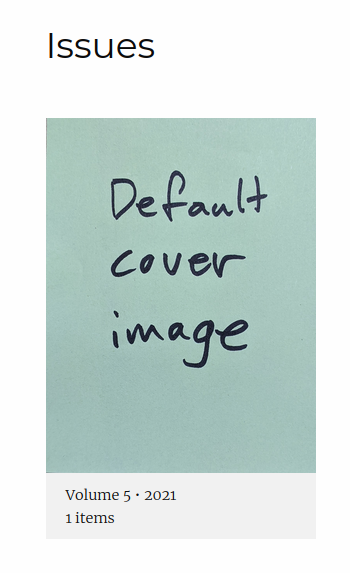
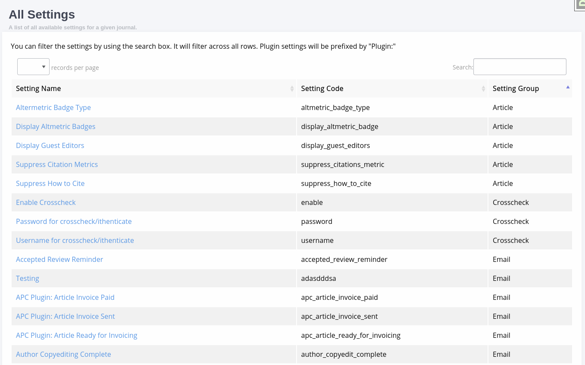

# Journal Settings

In journal settings, you can set basic information about the journal,
configure home page elements, upload logos and banner images, and adjust
some display elements.

If you have the Janeway role Editor or Staff, you can access Journal
Settings by selecting **Manager** under **Staff**.

## General

The general journal settings page is home to various configuration
settings for the journal. Each field is explained in Janeway.

  - Journal information (title, ISSN, description, keywords, design
    theme)
  - Publisher information (name, website, contact)
  - Email settings for system-generated emails
  - Remote website settings
  - Language settings
  - Integration with Slack or Discord

## Home Page

Here you can activate features for your journal home page.


To add a homepage element, select **Add** under **Add Home Page
Features** and then select **configure** to see options for that
element. You can reorder elements by dragging and dropping them.

  - About  
    Displays the journal description. If you edit the description here,
    it will also change in the other places it appears.

  - Carousel
    
    <div id="carouselanchor">
    
    A rotating banner that can be configured to display one of the
    following:
    
    </div>
    
      - Latest articles
      - Latest news
      - A combination of both
    
    You can select the number of items to display as well as select the
    items you want to include or exclude.

  - Current Issue  
    Takes whichever issue is marked as current and displays its table of
    contents on the home page. To learn how to select a current issue
    check the `issue page<currentissueanchor>`.

  - Featured Articles  
    Allows you to select a series of articles to display on the
    homepage. The selected articles are displayed in a grid that will
    cascade onto a new line every three articles.

  - HTML  
    A generic segment that you can customize according to your needs. It
    can hold text as well as more complex HTML such as a Twitter
    timeline.

  - News  
    Displays a list of the most recent news items. You can configure the
    number of items to display (the default is 5).

  - Popular Articles  
    Displays the most-accessed articles. You can configure the number of
    items as well as how recent the articles should be.

## Images

Below are explanations of the fields you see in Settings. See also the
`Styling section<imageguidelines>`.

<div class="tip">

<div class="title">

Tip

</div>

Janeway will automatically resize images to fit the designated spots it
has for them, but it won't change the proportions of width to height.

</div>


  - Header image  
    Typically the journal logo goes here. It appears in the top left
    corner on desktop or laptop screens, and at the top of the page on
    mobile devices.

  - Default large image  
    This image shows up in several places, depending on how your theme
    and home page are configured:
    
      - At the top of the article page if no article image is set
        specifically (see Article Images Manager) and article images are
        set to display (see Article Display Settings). If not set *and*
        article images are set to display, article metadata may not show
        up properly.
      - In the carousel on the home page for any items that don't have
        associated images. (In this spot it replaces the press-level
        "Default carousel image")
    
    Use a wide image (about 4 parts width to 1 part height) with good
    resolution when set at 300 or 400 pixels tall.

  - Press override image  
    This can be set to replace the press logo that appears in the footer
    when using the OLH theme or the clean theme.



  - Default cover image  
    The default image for issue covers when no image is set specifically
    for that issue.


  - Default thumbnail  
    The default image for each article when viewing an article list. A
    width-to-height ratio of about 3 to 4 is recommended. If no
    thumbnail is set, this defaults to the Janeway logo.

  - Favicon  
    The tiny little image you often see in the browser tab before the
    name of a webpage. Use a very small image of equal width and height.
    If not set, no Favicon will appear.

  - Default Profile Image  
    The default image used when editorial team groups have "Display
    profile images" enabled. The image is also used on the public
    profile page when a user has enabled it.

## Styling

This page displays some general settings for controlling the styling of
your journal.

  - Full Width Nav (only used by the Material theme)
  - Display Editorial Team Images
  - Enable Multi Page Editorial Team (splits the editorial team into
    pages by Group)

## All Settings

The all settings page lists every under-lying journal-level setting
within Janeway and allows you to edit them. The setting groups are:

  - Crossref
  - Email
  - Email Subject
  - General
  - Identifiers
  - Preprints
  - Review

This is a fallback area for editing a setting when you can't find it in
the interface or for editing settings introduced into your instance.



## Accessing Settings in Templates and Code

Setting values can be accessed inside templates using **{{
journal\_settings.group\_name.setting\_name }}**:

``` py
{{ journal_settings.crosscheck.enable_crosscheck }}
```

In Django they can be accessed with **get\_setting**:

``` py
request.journal.get_setting('group_name', 'setting_name')
```
