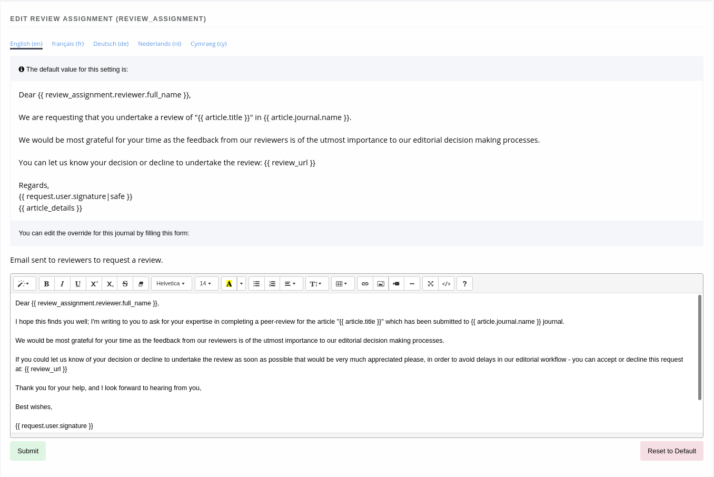

Other
=====

The *other* section covers three things:

-   Cache
-   Reminders
-   Email Templates

Clearing the Cache
------------------

Janeway uses a cache to speed up page loading, you can reset the cache
from the Manager page by clicking the Clear Cache button.

Scheduled Reminders
-------------------

::: {.note}
::: {.title}
Note
:::

The Scheduled Reminders manager has been updated as part of version 1.4.
:::

Janeway lets you define your own email reminders for overdue Reviews and
Revision assignments. They are defined using the following:

-   

    Type

    :   -   Review (new), Review (accepted) or Revision reminder.

-   

    Run Type

    :   -   Whether to run before or after the request is due.

-   

    Days

    :   -   The number of days before or after the request is due this
            reminder should be sent.

-   

    Template Name

    :   -   The name of the template that should be used when sending
            the reminder. If this template does no exist you will be
            asked to create it.

-   

    Subject

    :   -   The email subject to send with the reminder.

There are three types of reminder email supported by Janeway:

-   Review (Invited) - sent when a reviewer has been invited but not
    accepted a review request.
-   Review (Accepted) - sent when a reviewer has accepted a review
    request but not yet completed it.
-   Revision - Sent to authors with active revision requests.

Review reminders, both invited and accepted, are sent based on the
review assignment due date set by the editor. Revision reminders are
sent based on the revision request due date set by the editor. You can
set reminders to be sent either before or after the set due date.

A reminder email has access to three objects in the template:

-   review\_assignment or revision (depending on which type of reminder)
-   journal - the journal sending the reminder
-   article - the appropriate article

On the edit template page there is a small guide showing some of the
variables you can use when generating these templates.

Once a reminder is created a Cron job on the server will start
processing requests but it will not process these for Review and
Revision requests that have passed the reminder dates.

::: {.tip}
::: {.title}
Tip
:::

If automated reminders are not being sent for your journal the most
likely explanation is that the cron job has not been setup properly. You
should contact your administrator who can setup the call to the
send\_reminders management command.
:::

Email Templates
---------------

The email templates system allows you to search through and edit all of
the email templates for a given journal.

::: {.warning}
::: {.title}
Warning
:::

Editing an email template could cause it to break.
:::

Each email template has access to different objects which makes
documenting this quite difficult. We will be updating our
[FAQ](https://janeway.freshdesk.com/support/solutions/folders/43000574528)
with information on templates that are edited regularly.

When editing a template you will see the default version of the email at
the top and a rich-text editor below. If you do not have a specific
setting for your journal (ie. you\'ve never overwritten the default
setting) the rich text box will appear blank. To get started you can
copy the default version into the rich-text box and make your edits.

::: {.tip}
::: {.title}
Tip
:::

When editing an email that has a URL placeholder (like {{ review\_url }}
) it is important that you do not add anything immediately after this
placeholder as email clients may interpret them as part of the link.
:::

Publication Notifications (Readers)
-----------------------------------

Janeway (as of version 1.4.4) supports publication notifications via a
new role called \"reader\". This feature can be toggled on or off for
any given journal. Once the setting is toggled on anyone with an account
can sign up to receive emails when new articles are published via their
profile page. This feature has been designed with continuous publication
in mind but will also work well for those who publish full issues.

Journal staff can toggle the feature on by visiting Manager \>
Publication Notification (Readers) and using the link displayed on that
page (see figure above).

Readers can signup for notifications by logging into a journal and
selecting the Edit Profile link from the account menu (top right hand of
any page).

Emails are sent in a digest format (all published articles sent in one
email) once per day. On days when no articles are published no
notifications are sent. Emails are sent using BCC so only a single email
is sent.
