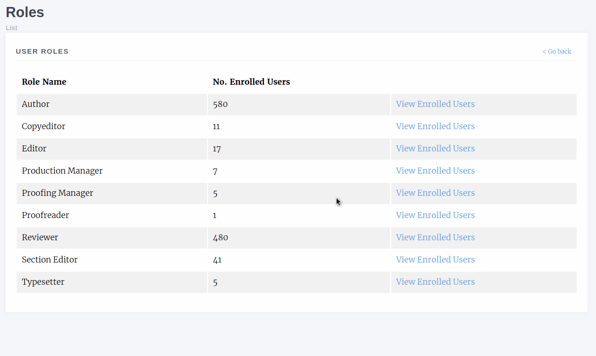

# Users

The Users section of the manager has various controls for different
permission levels.

Editors have control of:

  - Enrolled Users (users who have a role on your journal)
  - Enrolling Users (giving users a role on your journal)
  - Journal Roles (viewing users with a given role)

Staff have additional controls for:

  - Inactive Users (users who have not activated their accounts)
  - Authenticated Users (lists users with active sessions)
  - Merge Users (available at the press level)

## Enrolled Users

The journal users interface lists all users who have one or more roles
on your journal. From this page we can:

  - Edit a user

  - Add new users

  - Add multiple users to roles

  -   - View a user's assignment history
        
          - Editorial assignments
          - Review assignments
          - Copyediting assignments
          - Production assignments

### Editing a User

The edit user interface is relatively standard though there are a few
things to note:

  - Is staff should only be given to Journal Managers/Publishers and can
    only be assigned by other staff
  - Is admin grants access to Janeway's admin data layer
  - Is superuser will set a user to have all roles across the entire
    system

## Enrol Users

The enrol users page allows Editors to search for existing user accounts
and assign them a role in their journal.

Warning

As of version 1.3.10 of Janeway editors can no longer browse a list of
users and must search by name or email address to find existing users.

You can search for existing user accounts by:

  - First Name
  - Last Name
  - Email Address

Tip

You don't need to search by all three fields. You can search by just
first name or email address for example.

Once you have found an account you will be able to see which roles they
have and which are available to be assigned to them.

## Inactive Users

The inactive users screen is accessible to staff only and lists all
users who have not yet activated their account. You are cautioned only
to activate accounts that you've confirmed ownership for.

## Roles

The roles interface presents a list of Janeway's core roles:

  -   - Author
        
          - Any user who registers with your journal is given this role

  - Copyeditor

  -   - Editor
        
          - Handles processing of articles and assignment of tasks

  -   - Journal Manager
        
          - Has a similar level of permission to the Editor role, but
            can be given extra access (see below)

  -   - Production Manager
        
          - Handles the assignment and processing of Typesetting
            articles

  -   - Proofing Manager
        
          - Handles assignment of proofreaders and requesting
            typesetting changes

  - Proofreader

  -   - Reader
        
          - This role indicated whether a user is signed up for now
            article notifications

  - Reviewer

  - Section Editor

  - Typesetter

Once you have selected a role you will be presented with a list of users
who currently have that role. There is also an option to remove the role
from that user.

## Authenticated Users

Presents a list of users who are currently logged into your install of
Janeway. Only accessible to staff.

## Merge Users (Press Manager only)

The press manager now enables staff members to merge two accounts to
eliminate potential duplicates. All associated objects such as tasks,
articles, roles, and files will be moved from the source account to the
destination account. The account profile remains unchanged, meaning any
profile information in the source account will be lost.

Warning

When searching for users to merge, note that the user account in the
left column will be merged into the user account in the right column.

## Granular Manager Permissions

In version 1.5 we introduced more granular manager permissions.
Initially these are centered around the journal manager and editor
roles. We are introducing a new setting group "Permission", and within
this group we will be adding new permission controllers starting with:

  -   - Licenses
        
          - Controls whether a user can access the licenses control
            pages base on their roles, defaults to Editor and Journal
            Manager

  -   - Sections
        
          - Controls whether a user can access the sections control
            pages base on their roles, defaults to Editor and Journal
            Manager

Currently there is no interface for updating the roles that can access
these pages and the setting is JSON stored in the database.

Warning

You should only edit the Permission settings if you are sure about the
change you are making.

By default both settings read \["editor",
"journal-manager"\]. If, for example, you wanted to stop editors
from editing licenses you could change it to read
\["journal-manager"\]. Once saved, only
users with the journal manager role will be able to access the licenses
pages.

## Granular Settings Permissions

In version 1.5 we introduced granular settings permissions. Staff can
now determine, for any given setting object, which roles are allowed to
edit it. This is done via the Django Admin panel (Core \> Settings),
using the editable\_by field. Staff can
alter the roles that are allowed to see and edit a setting.

Note

If a setting is also displayed on a settings group page (for example the
General or Submission settings page) and a user does not have the
appropriate permission to edit that setting it will be filtered out of
the form and not be visible.

As with the manager permissions changes the default to settings
permission maintains the status quo and by default all settings are
editable by editors and journal managers.
