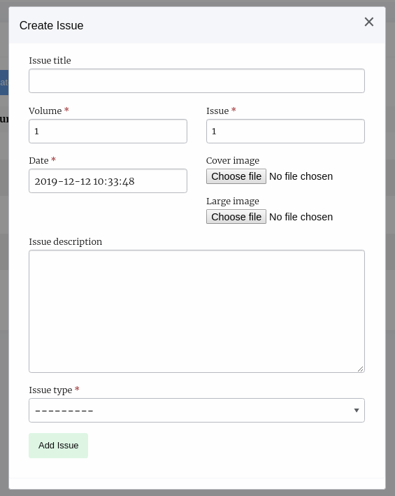
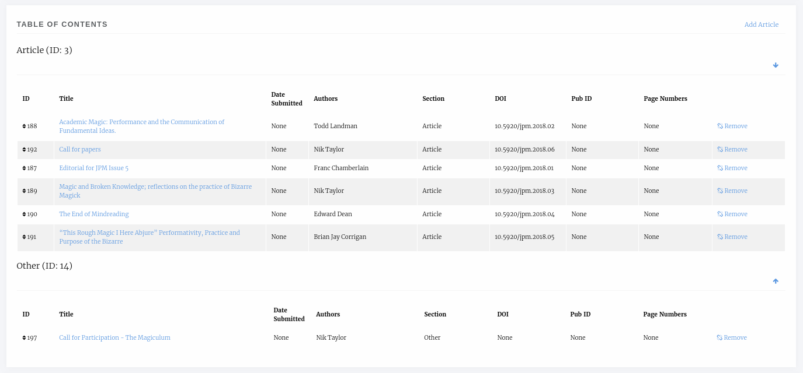
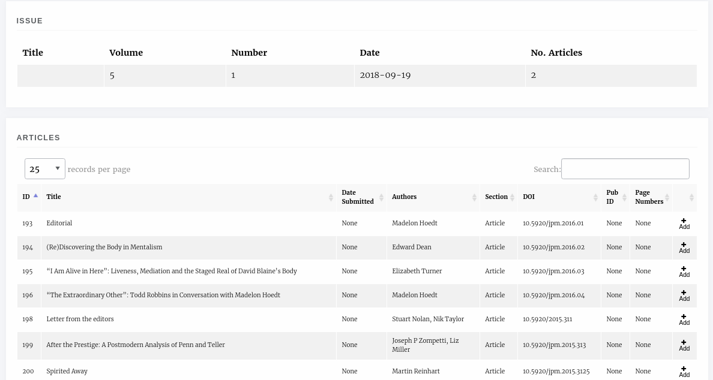
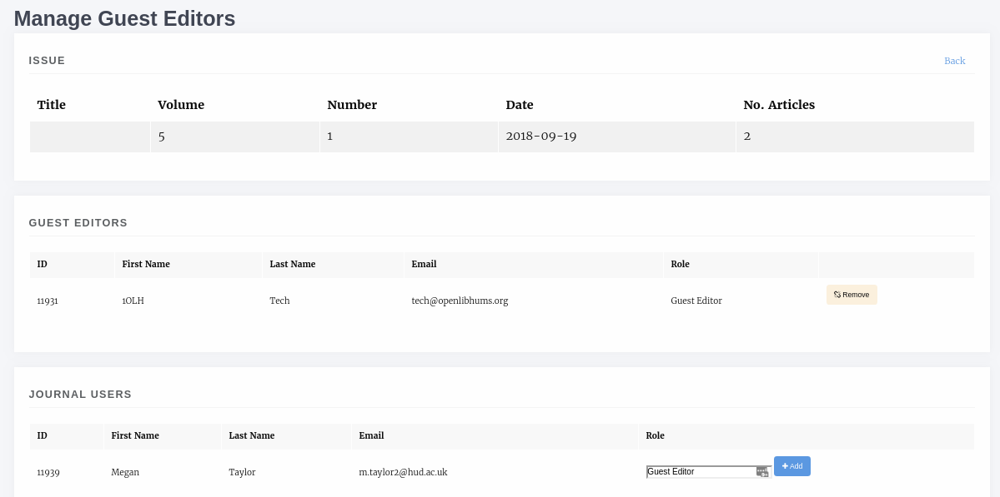
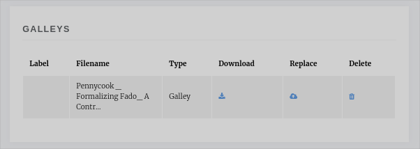

Issues
======

Articles do not have to be part of an issue. There are some services
that do require an article have an issue or volume (such as Crossref) so
we recommend that if you do continues publication that you create a
yearly volume/issue to add papers to. Articles are added to Issues
during the Pre Publication stage, however, Issues can be managed on
their own through the Issue Manager, a link to which is available on the
Manager page and the main sidebar.

::: {.tip}
::: {.title}
Tip
:::

To set the current issue, click the Make Current button. The Issue
without this button \_[is]() the current issue.
:::

::: {.tip}
::: {.title}
Tip
:::

To re-order the issues you can drag and drop the rows of the tables or
use the sort buttons at the top of the page.
:::

Issue Types
-----------

Janeway comes with two issue types built in: Issue and Collection.
Collections differ in so much as they are not a primary Issue for a
paper but tend to be collections of papers with similar topics across
multiple different issues. So an article may be in the Thomas Pynchon
Collection but it\'s primary Issue may be Volume 1 Issue 2 2019. You can
also define your own issue types in the Django admin area.

Display Settings
----------------

In the top right of the Issue Management page there is the Edit Display
Settings button. This allows you to configure how issue titles and the
issue page are displayed.

You can turn these elements on or off:

-   Volume number
-   Issue number
-   Issue year
-   Issue title
-   Article number
-   Article page numbers
-   Issue DOI
-   Group issues by decade

Here are a few example issue displays:

-   Volume 6 • Issue 3 • Fall 2015 • 5--17
-   Winter 2009 • 19 pages
-   Volume 35 • 2021 • Number 49

::: {.tip}
::: {.title}
Tip
:::

If you want to display a totally custom issue title, disable everything
except issue title, and use that field to form the issue display for
each issue.
:::

::: {.tip}
::: {.title}
Tip
:::

You can use the article number field to set an arbitrary number for each
article, whether to distinguish articles within each volume or issue or
to number articles across volumes and issues. Article number is an
optional field separate from article ID and can be set in Edit Metadata.
:::

::: {.tip}
::: {.title}
Tip
:::

If your journal has a lot of issues you can enable the \"Group issues by
decade\" feature to allow readers to jump to a specific decade on the
issues interface.
:::

Creating and Editing Issue Details
----------------------------------

You can create new issues from this page using the Create Issue button
and you view and edit the detail of individual issues by selecting them.

Information on the sizes of the cover image and large image can be found
in the `Styling<imageguidelines>`{.interpreted-text role="ref"} section

Manage an Issue
---------------

Clicking on View takes you through to the manage issue page where you
can alter an individual issue. The page is split into 4 sections.

-   Issue Management
-   Table of Contents
-   Guest Editors
-   Galleys

### Issue Management

Here you can see the metadata for your issue, edit it, delete it and if
the issue is published there is a link to view it on the front end.

### Table of Contents

In the Table of contents section you can add articles to the issue, sort
the sections and sort the articles within their sections.

For each section there are arrow icons that allow you to move the
section up and down, each of the articles can be dragged and dropped
into order from inside their section.

You can drop an article from an issue using the Remove link and add new
ones clicking the Add Article link.

A list of all articles published in the journal that are not already in
the issue is displayed and you can use the Add button to place it in the
issue.

### Guest Editors

An issue can list Guest Editors if the articles aren\'t being handled by
the normal editorial team. Use the Manage button to control who appears
as a Guest Editor for an issue/collection.

When adding a new guest editor you can also enter a role, the default
text for this role is *Guest Editor* though you can change it. Use the
Add button to add a new guest editor.

### Galleys

You can upload a Galley file for the whole issue, usually a PDF so that
users can download the whole issue in one go.

::: {.tip}
::: {.title}
Tip
:::

If you don\'t upload a Galley for the issue then Janeway will allow
users to download a zip file of all the individual article galley files.
:::

### Issue DOIs

Issues can be assigned a DOI in Janeway. This can be done ad-hoc for
each issue by editing the issue details and inputting the DOI manually,
or by letting Janeway generate a DOI for you, based on a pattern (a DOI
pattern can be set from the Crossref Settings page)

When the Crossref integration is enabled, issue DOIs will be registered
with Crossref whenever an article in that issue is registered with
Crossref. This will be the case both for DOIs generated for Janeway as
well as for those manually set.

::: {.tip}
::: {.title}
Tip
:::

If you are migrating a Janeway installation from a version that did not
support issue DOIs and would like to register issue DOIs for your back
content, this can be done by populating the DOI field on those issues
and then re-registering any of the articles in the issue with Crossref.
:::

::: {.warning}
::: {.title}
Warning
:::

When an article is part of two or more issues, only the primary issue
DOI will be registered with Crossref. In a future version, it will be
possible to register issue DOIs on their own, even when they have no
articles or all its articles are part of multiple issues.
:::
