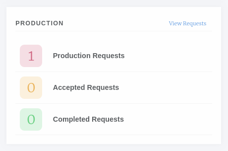
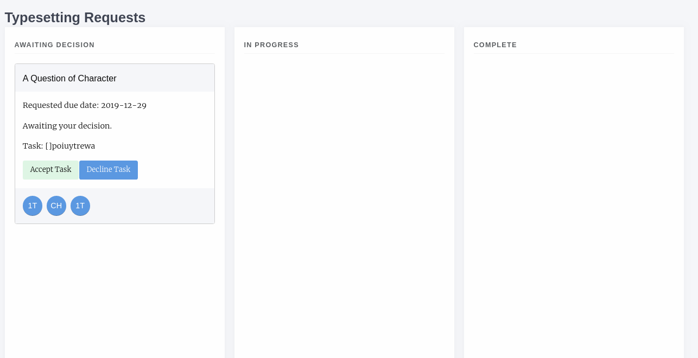
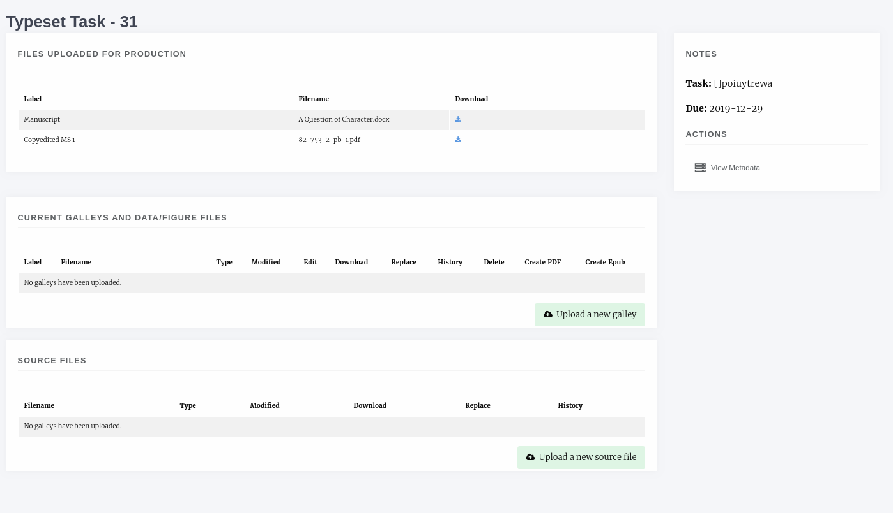
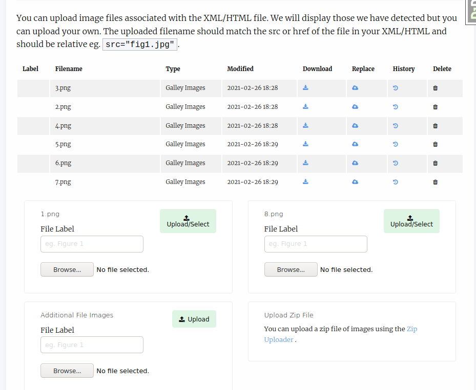

# Typesetter Guide

When a typesetting task is assigned you will receive an email
notification and also be able to see the task on your dashboard under
\_[Production]().



Clicking on view requests will display three columns

  -   - Awaiting Decision
        
          - New Assignments.

  -   - In Progress
        
          - Assignments you have accepted but no completed.

  -   - Completed
        
          - Assignments you have completed.



## Typesetting a Paper

Once you have accepted a request you can then use the view button to
display the typesetter interface. This allows typesetters to pull files
and view the metadata of the paper so they can produce Galley proofs.
The interface is broken in 4 sections.

  -   - Files uploaded for production
        
          - Lists the files that are to be used in generating the galley
            proofs.

  -   - Current Galleys
        
          - Lists any galley proofs that already exist.

  -   - Source Files
        
          - This is an area for you to upload any intermediate source
            files (indesign etc).

  -   - Notes
        
          - Displays the request from the editor and a link to view the
            article's metadata.



## Uploading a Galley

You can use the Upload a new galley button to upload a new file. There
are three upload options.

  - XML/HTML
  - PDF
  - Other (for any other file types)

Janeway processes each differently (or in the case of Other, not at all)
so ensure you select the correct upload box.

<div class="warning">

<div class="title">

Warning

</div>

Janeway operates with the UTF8 encoding, so you should ensure your plain
text galleys (HTML and XML) use this encoding.

</div>

### Missing Supplements

When you upload an XML or HTML galley Janeway will scan it for images
and warn you if there you need to upload those images. You can do this
by editing the galley file.


In the Edit Galley screen you can upload individual image files, select
from exising figure files or upload a zip file of images.

<div class="tip">

<div class="title">

Tip

</div>

If you have lots of images ensure they have the correct name (eg,
whatever they are called in the XML/HTML file) and zip them. You can use
the zip uploaded to upload them in one go.

</div>

## Managing Galleys

In addition to uploading images alongside galley files you can also:

  - Replace the galley if you've made changes to the original file.
  - Upload a CSS file to go along with the galley.
  - Change the XSLT file used to render the galley.
  - View the galley's history or delete it.

## Completing Typesetting

Once you have uploaded the required galleys and their files you will
notice a new Note to Editor box has appeared in the Notes section, you
can use this to complete your task.

Once you have marked it as complete the card will move into the
Completed column.

## Typesetting Plugin (New\!)

The Typesetting plugin is the new workflow used in Janeway for
typesetting. It is currently deployed as a plugin but we intend to
replace the above process with this new system in the near future.

With this new plugin, we aim to simplify the process of working on
corrections for the typesetter with a brand new interface that is used
both when uploading the initial typesetting files as well as when
working on corrections. The summary of improvements includes:

  - Unified interface for all typesetting tasks
  - Better and more complete display of the article metadata
  - Error detection warnings: Incomplete corrections, missing figure
    files, missing metadata...
  - Full display of the proofreading comments and corrections requested
  - Single input form for uploading galley files

On your dashboard, there should be a card indicating the number of
typesetting tasks that are currently awaiting for you to complete:


When uploading a new Galley (now referred to as 'Typeset Files'), there
is now a single button interface where the typesetter uploads a file and
gives it an optional label. Janeway will use the best label for the file
provided, but typesetters can edit the label to add a different one if
necessary.


### Image Files

When a typeset file in the XML or HTML format is uploaded that has image
links Janeway will detect them and prompt the typesetter to upload them.
Image filenames should match those within the XML or HTML.


At this point, press the edit button and upload each image on the box
matching the filename from the XML/HTML file:



If an XML or HTML file has a large number of images it is often faster
to use the zip uploader. Create a .zip archive file and within it place
each of the image files. The image filename must match the link in the
typeset file otherwise it will not import them.

### Source Files

If any intermiadate files have been used for the production of the Files
(such as Adobe In Design files), they can be uploaded under the 'Source
Files' section


### Finishing Up

Before you can complete the task, Janeway will warn you of any potential
problems it detects with your files, such as potential missing images on
the XML/HTML files or Typeset Files that have not yet been corrected.


Once you are done with the typesetting or correction task, you can leave
a note for the editor and complete it for the editor to review.

## Typesetting Recipes

### Right-to-Left Text Direction

Arabic and many other languages are written right to left, requiring
special markup in an XHTML environment that operates left-to-right by
default.

Here is an example in JATS XML of an isolated bit of Arabic text in a
document that is otherwise left-to-right:


Make sure you use a text editor that shows zero-width unicode
characters, like U-2067. The above screenshot is an XML file opened in
VS Code.

Here is the rendered output:


Notice the following about the code sample:

1.  On each line, begin with the [RLI unicode character
    (U+2067)](https://www.unicode.org/reports/tr9/#Explicit_Directional_Isolates)
    at the beginning of the line to explicitly trigger right-to-left
    rendering for the remainder of the line, including symbols like
    periods that the browser would otherwise render left-to-right. This
    is roughly equivalent to the HTML attribute
    <span class="title-ref">dir="rtl"</span>. If working with periods or
    other punctuation, note that they may appear on the right in your
    code editor, but render on the left in the browser.
2.  Wrap each line in the [styled-content JATS
    element](https://jats.nlm.nih.gov/publishing/tag-library/1.3/element/styled-content.html)
    and apply a [style
    attribute](https://jats.nlm.nih.gov/publishing/tag-library/1.3/attribute/style.html)
    specifying CSS for right text alignment and block display.
3.  When working with long lines of text, make sure not to introduce
    arbitrary line breaks.

### Center Alignment

In some cases you might need to center-align text:

``` xml
<p>Then came the apotheosis of modernism:</p>
<disp-quote>
    <styled-content style="text-align: center; display: block;">
        Leaves are falling
    </styled-content>
</disp-quote>
```

The output is:


This is accomplished with the the [styled-content JATS
element](https://jats.nlm.nih.gov/publishing/tag-library/1.3/element/styled-content.html)
and a [style
attribute](https://jats.nlm.nih.gov/publishing/tag-library/1.3/attribute/style.html)
specifying CSS for center text alignment and block display.
